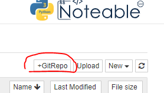

# Introductory Applied Machine Learning for Finance, Technology and Policy (INFR11182)

## Using Notable to run the labs

1. In Learn, navigate to **Labs** and click on the **Notable** link
2. Under **Start Personal Notebook**, click on the **Start** button
3. At the right, click on the **+GitRepo** link:
   
4. In the box entitled **Enter a Git Repository URL**, paste the
   following:
   ```
   https://github.com/davidcsterratt/iaml-labs
   ```
   and click on **OK**
5. After a few seconds you should find an `iaml-labs` folder in the
   **Files** tab.
6. Navigate to `iaml-labs/Labs` to find the Lab notebooks


<!--  LocalWords:  INFR GitRepo iaml
 -->
